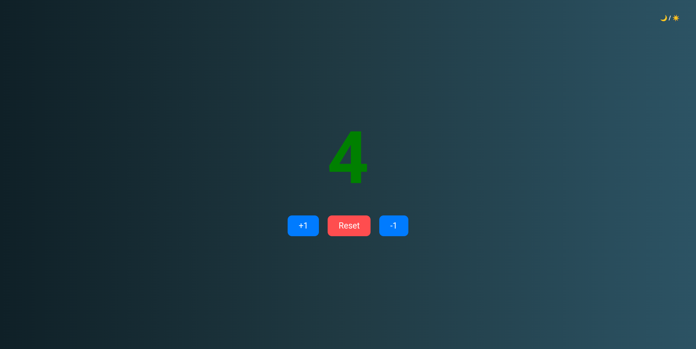

# 🧮 Contador en JavaScript  

## 📌 Descripción  
Un contador simple hecho con **HTML, CSS y JavaScript puro**, que permite **sumar, restar, reiniciar** y **guardar el valor en localStorage**.  
Incluye animaciones, sonidos y un modo **claro/oscuro con degradados**, también persistente en localStorage.  

---

## 🚀 Funcionalidades  
- ➕ **Sumar** números.  
- ➖ **Restar** números.  
- 🔄 **Resetear** el contador a 0.  
- 💾 Guarda el valor en el **navegador con localStorage**.  
- 🎨 Cambia el color del número según si es positivo, negativo o cero.  
- 🌗 Botón de **modo claro/oscuro**, con fondo degradado.  
- 🎵 Sonidos al interactuar con los botones.  
- ✨ Animación al actualizar el número.  

---
## 🔗 Demo  
[👉 Ver en GitHub Pages](https://ciriodev.github.io/contador-js/)

## 🖥️ Capturas  

### 🌗 Modo oscuro
  

### ☀️ Modo claro

---

## ⚙️ Tecnologías usadas  
- **HTML5**  
- **CSS3 (Flexbox, degradados, animaciones)**  
- **JavaScript (DOM, eventos, localStorage, classList)**  

---

## 📚 Lo que aprendí  
- Cómo usar `localStorage` para guardar datos (contador y tema).  
- Manejo del DOM con `document.querySelector` y `addEventListener`.  
- Diferencia entre `innerText`, `textContent` y `.value`.  
- Uso de `classList` para cambiar estilos dinámicamente.  
- Cómo reproducir sonidos en eventos de usuario.  

---

## 🚩 Próximas mejoras  
- Mejorar la UI con botones más modernos (quizás con íconos SVG).  
- Añadir transiciones entre tema claro/oscuro.  
---  
